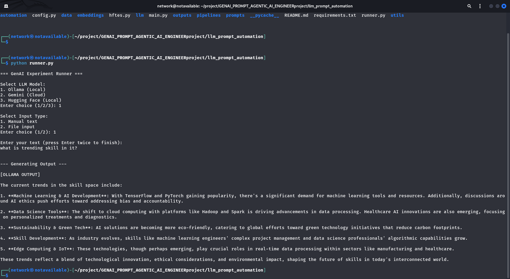
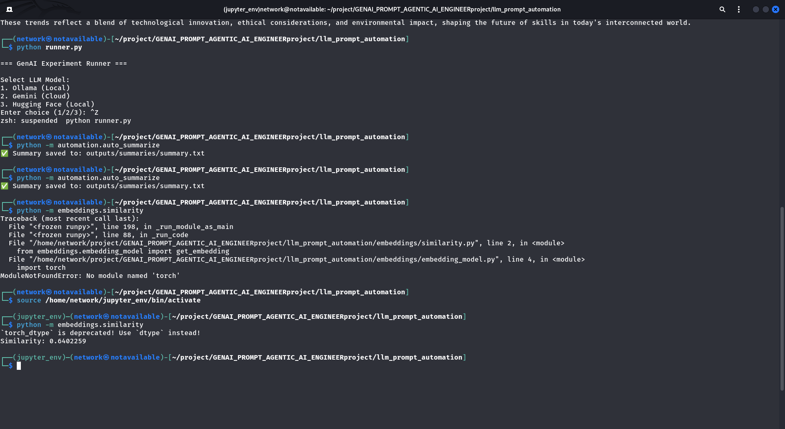

# LLM Prompt and Automation Experiments

An introductory yet hands-on **Generative AI experimentation project** built with Python.
This project demonstrates how to design **prompt-based workflows**, integrate **multiple LLM backends**, build **LangChain pipelines**, and create **automation scripts** for real-world text processing tasks.

The system follows a **local-first, modular architecture**, with optional cloud LLM support.

---

## 🚀 Project Goals

- Learn and implement **prompt engineering**
- Experiment with **local and cloud-based LLMs**
- Build **LangChain pipelines** for structured GenAI workflows
- Automate repetitive text-processing tasks using LLMs
- Explore **semantic embeddings and similarity**
- Design a **clean, modular GenAI project structure**

---

## 🧠 Key Features

- Prompt-driven **text generation, summarization, and analysis**
- **Local LLM inference** using Ollama (offline & reliable)
- **Cloud LLM support** using Google Gemini API (optional)
- **Hugging Face local models** for text generation and embeddings
- **LangChain pipelines** connecting prompts → models → outputs
- **Automation scripts** for file-based text workflows
- **Semantic similarity** using embeddings (PyTorch + Transformers)
- **Interactive runner** for model and input selection

---

## 🗂️ Project Structure

```
llm_prompt_automation/
│
├── runner.py                  # Interactive demo runner (optional)
├── main.py                    # Simple demo entry point
├── config.py                  # Environment & configuration
├── requirements.txt
├── README.md
│
├── prompts/                   # Prompt templates
│   ├── text_generation.txt
│   ├── summarization.txt
│   └── analysis.txt
│
├── pipelines/                 # LangChain pipelines
│   ├── text_generation_chain.py
│   ├── summarization_chain.py
│   ├── analysis_chain.py
│   └── __init__.py
│
├── llm/                       # LLM backends
│   ├── ollama_client.py       # Local LLM (default)
│   ├── gemini_client.py       # Cloud LLM (optional)
│   └── hf_client.py           # Hugging Face local models
│
├── automation/                # LLM-powered automation
│   ├── auto_summarize.py
│   └── auto_analyze.py
│
├── embeddings/                # Semantic similarity
│   ├── embedding_model.py
│   └── similarity.py
│
├── utils/
│   └── file_utils.py          # File reading utilities
│
├── data/
│   └── sample_text.txt
│
└── outputs/
```

---

## ⚙️ Setup Instructions

### 1️⃣ Create virtual environment (optional but recommended)
```bash
python -m venv .venv
source .venv/bin/activate
```

### 2️⃣ Install dependencies
```bash
pip install -r requirements.txt
```

### 3️⃣ Configure environment variables

Create a `.env` file:

```env
# Local LLM
OLLAMA_MODEL=deepseek-r1:1.5b

# Cloud LLM (optional)
GEMINI_API_KEY=your_gemini_api_key_here

# Hugging Face (local usage only)
HF_API_TOKEN=optional
TRANSFORMERS_NO_TF=1
```

> ⚠️ The project runs **fully offline** using Ollama and Hugging Face local models.  
> Gemini is optional and used only when explicitly selected.

---

## ▶️ How to Run

### 🔹 Interactive Runner (Recommended)
```bash
python runner.py
```

You can:
1. Select LLM backend  
   - Ollama (local)  
   - Gemini (cloud)  
   - Hugging Face (local)
2. Select input type  
   - Manual text  
   - File input

---

### 🔹 Run Individual Components

#### Text generation / summarization demo
```bash
python main.py
```

#### Automation scripts
```bash
python -m automation.auto_summarize
python -m automation.auto_analyze
```

#### Embeddings similarity
```bash
python -m embeddings.similarity
```

---

## 🧩 LLM Backends Explained

### 🟢 Ollama (Local – Default)
- Fully offline
- Reliable
- No API cost
- Used in main pipelines

### 🟡 Gemini (Cloud – Optional)
- Fast cloud-based LLM
- Requires API key
- Used only when selected explicitly

### 🟢 Hugging Face (Local)
- `google/flan-t5-small` for instruction-based text generation (<1GB)
- Hugging Face Transformers for embeddings
- No cloud inference dependency

---

## 🔍 Embeddings & Similarity

- Text converted into dense vectors using Transformer models
- Cosine similarity used to measure semantic closeness
- Demonstrates core NLP understanding beyond text generation

---

## 🏗️ Architecture Diagram

```
User Input (Manual / File)
        │
        ▼
 Interactive Runner (runner.py)
        │
        ├── Ollama (Local LLM)
        │       └── LangChain Pipelines
        │
        ├── Gemini (Cloud LLM)
        │       └── Direct API Call
        │
        └── Hugging Face (Local Models)
                ├── Text Generation (FLAN-T5)
                └── Embeddings & Similarity
        │
        ▼
 Generated Output / Analysis / Summary
```

This diagram shows how user input flows through the interactive runner, reaches the selected LLM backend, and returns the generated output in a modular and decoupled manner.

---

## 📸 Screenshots / Demo

Below are real screenshots captured during development and testing. These demonstrate the interactive runner, model selection, automation workflows, and embeddings execution.

> **Note:** For better repository hygiene, it is recommended to place screenshots inside an `assets/screenshots/` directory and rename them meaningfully as shown below.

### 1️⃣ Interactive Runner – Model Selection


*(Screenshot shows interactive LLM model selection in `runner.py`)*

---


### 2️⃣ Input Type Selection (Manual / File)


*(Screenshot shows manual vs file input selection flow)*

---


### 3️⃣ Gemini Cloud Model – Text Generation Output


*(Screenshot shows successful LLM-generated response using **Google Gemini (cloud)** model via the interactive runner)*

---


### 4️⃣ Automation Script – Summarization Output Saved


*(Screenshot shows automated summarization output saved to file)*

---


### 5️⃣ Embeddings Similarity Execution


*(Screenshot shows embeddings similarity calculation and automation execution)*

These screenshots validate that all major components of the project are functional and integrated correctly.

---


## 🧠 Design Philosophy

- **Modular by design**: each feature works independently
- **Local-first approach**: avoids API instability and billing risks
- **Separation of concerns**: prompts, pipelines, LLMs, and automation are isolated
- **Experiment-focused**: built for learning, not production deployment

---

## 📌 Limitations (Intentional)

- No vector database (FAISS / Pinecone)
- No RAG or agent frameworks
- No production deployment setup

These are intentionally excluded to keep the project focused on **GenAI fundamentals**.

---

## 🎯 Learning Outcomes

- Practical understanding of prompt engineering
- Hands-on LangChain pipeline creation
- Experience with local vs cloud LLM trade-offs
- Exposure to real-world GenAI debugging
- Clean GenAI project structuring

---

## 🏷️ Resume Description (Safe to Use)

> Built a modular GenAI experimentation system using Python and LangChain, implementing prompt-based text generation, summarization, and analysis workflows. Integrated local LLM inference via Ollama, optional cloud-based inference using Google Gemini, and Hugging Face local models for text generation and embedding-based semantic similarity. Developed LLM-powered automation scripts for text processing.

---

## 👤 Author

**Shyam Ji**  
AI Engineer | GenAI Enthusiast | Data Science | Machine Learning | Python Developer | Cyber Security Analyst & Ethical Hacker

- GitHub: https://github.com/shyamji-engineer
- Portfolio: https://shyamjirajput.vercel.app/
- LinkedIn: https://www.linkedin.com/in/shyamjiengineer
- Location: India

---

## 📜 License

This project is intended for **learning and experimentation purposes**.

